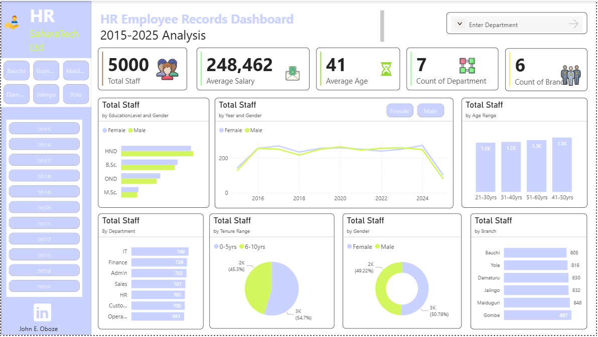

# Data-Analytics-portfolio1
## About
Hello, I am John Ehiabhi Oboze, a Data Analyst and problem solver passionate about helping businesses grow using Data and turning data into actionable insight for decision making.
I am isnspired and lead into Senior Data Analyst role and helping African businesses make smarter decisions. I have built data dashboards that increase team productivity and performance by a huge margin.

## Skills
Data visualization - Power BI, Excel, SQL

Data Analytics coaching 

## Projects
HR Employees Record Analysis
Sales and profits Performance Analysis
Sales Report Analysis
Hospital Patients Record Analysis
Bank Churn Analysis
Oil Production Analysis
SRV Re-Reg Team Performance Analysis
SRV Automation Performance Analysis
